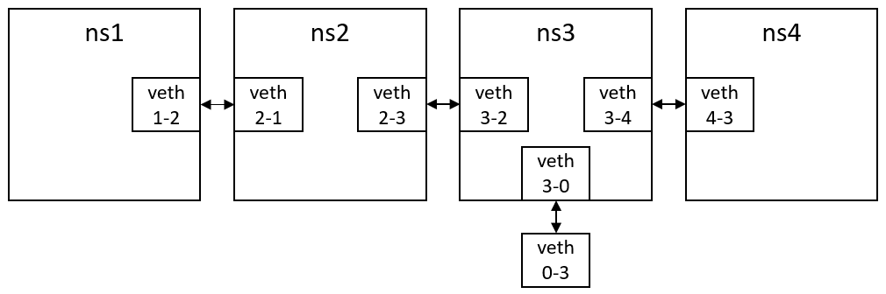
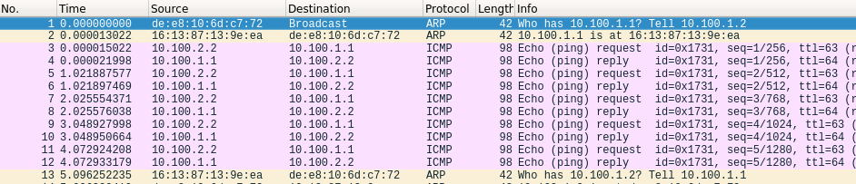

# vnetUtils

`vnetUtils` is a handful of short scripts for you to create & use virtual networks using [Linux network namespaces(netns)](http://man7.org/linux/man-pages/man8/ip-netns.8.html) and [virtual ethernet device(veth) pairs](http://man7.org/linux/man-pages/man4/veth.4.html). You can create & use a virtual network with any desired topology with it.

## How It Works

Takeaway: we can say that a network namespace is an abstract host, and a virtual ethernet pair is a virtual cable, with NICs on its both end. It's then obvious that we can use these tools to build a network, with additional software.

Linux network namespaces are independent copies of the kernel protocol stack. That is to say, network namespaces have their own sets of network devices, firewalls, DNS configurations, etc. In fact, you can imagine that like every other pieces of program, network protocol stack contains code and data. All network namespaces share the same implementation of the protocol stack, but their "config files" are different, causing them to be different from others. That's just how it was implemented. Network namespaces are differed by their data files, and typically, you can give it a name when you create a new network namespace. You can then use the name to refer to it. A default network namespace(without a name, which forces us to use name bias to preserve consistency) is created by the Linux kernel when the network module is initialized. You can run any program _in_ a network namespace, just like running it on a remote host.

Virtual ethernet device pairs are virtual network devices. That is to say, They have drivers, looks like a network device to the OS, but they are totally software. Virtual ethernet device pair works like a tunnel: you send packets to one of the devices, and packets will come out from its peer device. Imagine you have a virtual ethernet device pair, with each of them in different network namespaces, you will be able to send packets between them! As you can see, it's simple enough to create two connected virtual hosts: create two network namespaces, and use virtual ethernet device pairs to connect them. By expanding this design, you will be able to create network with any desired topology.

The very next problem is how to run applications on them. We do have a protocol stack but it is broken in the middle: virtual ethernet device drivers won't try to tell the OS to run a DHCP client or anything similar for them. So it's your work to manully allocate IP, set routing table, and enable IP forwarding for the hosts. You may also manually disable the kernel protocol stack by using firewall to drop all packets before the kernel gets hands on them.

## Helper Scripts

- addNS

    Add a new netns with specified name, do nothing if attempting to add default namespace.  
    Usage: `addNS [name]`  

- addVethPair

    Create a new veth pair with specified names for each of them.  
    Usage: `addVethPair [name1] [name2]`

- bypassKernel

    Disable kernel protocol stack.
    Usage: `bypassKernel`

- connectNS

    Use veth pair to connect two netnses, assign address for each of the veths, then configure routing table properly to let them know each other.  
    Usage: `connectNS [ns1] [ns2] [veth1] [veth2] [/24 IP prefix]`

    After execution, `[veth1]` will get address `[/24 IP prefix].1`, `[veth2]` will get address `[/24 IP prefix].2`.

- delNS

    Remove a netns with specified name, do nothing if attempting to remove default namespace.  
    Usage: `delNS [name]`

- delVeth

    Remove a veth with specified name(its peer device will be removed automaticly).  
    Usage: `delVeth [name]`

- enableForward

    Enable IP forwarding.  
    Usage: `enableForward`

- execNS

    Execute a command in specified netns.  
    Usage: `execNS [name]`

- giveAddr

    Assign an IP address to a device and enable it.  
    Usage: `giveAddr [device] [IP/pflen]`

- setGRoute

    Configure routing table to recognize a WAN.  
    Usage: `setGRoute [subnet] [device] [gatewayIP]`

- setNS

    Put a veth in a specified netns.  
    Usage: `setNS [vethname] [nsname]`

- setRoute

    Configure routing table in current LAN.  
    Usage: `setRoute [subnet] [device]`

- undoBypass

    Revert the change made by `bypassKernel`.  
    Usage: `undoBypass`

Note:

- You should invoke those scripts in `helper/` only!

- Any netns name with suffix "ns0" will be resolved to the default namespace.

- Set `VNET_VERBOSE` example to `1` will cause the scripts to show you their behavior.

## Examples

In `examples/` we have developed two scripts, `makeVNet` and `removeVNet` for you. They both read a _config file_ describing the topology of the network from `stdin`, then create/remove a virtual network according to your input. Here we describe their input format and outputs:

- Input Format

    ```
    [namepref]
    [nhosts]
    [hostID1] [hostID2] [/24 IP prefix]
    ...

    [hostID3] [subnet] [hostID4]
    ...
    
    ```

- Output

    If successfully executed, `makeVNet` should generate a virtual network with `nhost` virtual host(netns)s, indexed from `1` to `nhost`(current namespace is also given an index `0`). For each input line with pattern `[hostID1] [hostID2] [/24 IP prefix]`, Host #`hostID1` and #`hostID2` will be connected using a veth pair. IP addresses of them are `[/24 IP prefix].1/24` and `[/24 IP prefix].2/24`. veth in the virtual host with smaller ID will get `[/24 IP prefix].1/24`. For each input line with pattern `[hostID3] [subnet] [hostID4]`, routing table in host #`hostID3` will be properly configured to forward packets to host #`hostID4` via the veth pair when sending to `subnet`. `removeVNet` should remove the virtual network created by `makeVNet` using the same input. 

    Also, if you have `VNET_VERBOSE` equals to `1`, The helper scripts called by `makeVNet` and `removeVNet` will give outputs. It is interesting to see how many commands is needed to create a virtual network with relatively simple topology(for the one in the example below, 50 helper script calls and 132 Linux net tool calls).

- Host & device naming 

    Host #`[ID]` -> `[namepref]ns[ID]`  
    Veth in host #`[A]` connecting host #`[B]` -> `[namepref]veth[A]-[B]`

- Input & output example

    Input:

    ```
    
    4
    1 2 10.100.1
    2 3 10.100.2
    3 4 10.100.3
    0 3 10.100.4

    1 default 2
    2 default 3
    3 10.100.1.0/24 2
    3 default 0
    4 default 3
    0 10.100.1.0/24 3
    0 10.100.2.0/24 3
    0 10.100.3.0/24 3

    ```

    Output:

    Virtual network with the following topology:

    

    You may find this topology useful when describing a typical client-server model with the client behind a router: `ns1` -> client, `ns2` -> router, `ns3` -> network between router and server, `ns4` -> server, `ns0` -> Remaining part of the Internet. The input has configured routing properly to match the abstraction.

Note: It is guranteed that the scripts will provide expected output ONLY when:

- You are the superuser;
- No device/netns naming conflicts happen;
- No IP address conflicts happen;
- Each pair of virtual hosts are connected only once.

Behavior of the scripts is not specified if wrong input is given. You may want to reboot the machine to reset the system if anything strange happened. 

Also, the kernel protocol stack is enabled by default. To disable/enable it for a virtual host, use:

```bash
# disable
helper/execNS [namePref]ns[ID] helper/bypassKernel
# enable
helper/execNS [namePref]ns[ID] helper/undoBypass
```

## A minimum tutorial
To help you get started as soon as possible, we have prepared a minimum tutorial. You should first unzip all the vnetUtils folder, and run:

```bash
# enter the folder
cd ~/vnetUtils
# convert the newline character
dos2unix ./examples/* ./helper/*
# add execution rights
chmod +x ./examples/makeVNet ./examples/removeVNet ./helper/*
# run makeVNet
cd ./examples
sudo bash ./makeVNet < example.txt
```

If no error message occurs, a virtual network with the topology above has been created. To verify this, you can open 3 terminals (numbered 1, 2, 3 respectively, all set directory to `vnetUtils/helper/`), and run the following command:

```bash
# in terminal 1
sudo bash ./execNS ns1 bash
# in terminal 2
sudo bash ./execNS ns2 wireshark # then capture veth2-1 in GUI
# in terminal 3
sudo bash ./execNS ns3 bash
ping 10.100.1.1 # already in ns3
```

You will see the following output in wireshark if the setup is successful.



Now you have learned how to create a virtual network and how to run programs with vnets. You can also try some other commands. Wish you have fun!